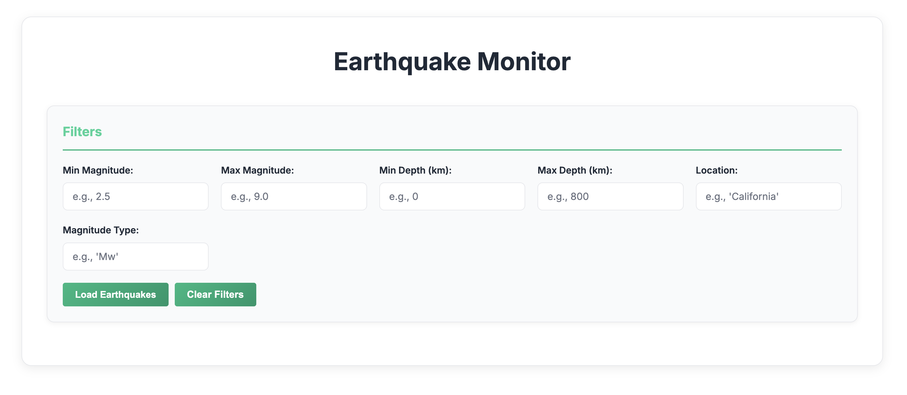
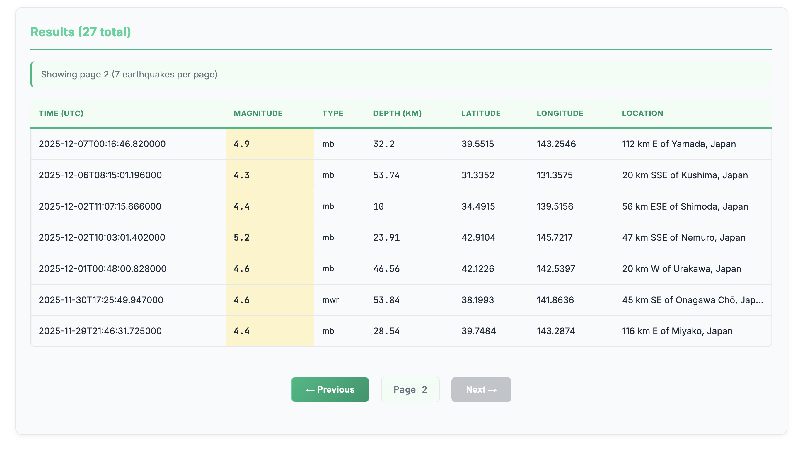

# Earthquake Monitor

Full-stack system for collecting, storing, and visualizing earthquake data from the USGS public API locally and exposing in a simple website to gain experience using Angular and Apis.

> **For detailed architectural decisions, see [docs/DESIGN_DECISIONS.md](docs/DESIGN_DECISIONS.md)**

## 📸 Demo Preview

### Dashboard & Filtering

*Main dashboard with advanced filtering capabilities for magnitude, depth, location, and magnitude type*

### Results & Pagination

*Paginated earthquake data with detailed information including location, magnitude, depth, and UTC timestamp*

## Project Specifications

| Aspect | Details |
|--------|---------|
| **Real-time Data** | Syncs with USGS API every 1 minute (configurable) |
| **Data Coverage** | 1+ days of historical earthquake data |
| **Performance** | Sub-second API response times with optimized indexes |
| **Scalability** | Supports 10,000+ earthquake records with async database operations |
| **Uptime** | Automatic error recovery and graceful degradation |
| **Database** | PostgreSQL 15+ with connection pooling (20 max connections) |
| **API Rate** | No external limits; internal pagination (default 20 items/page) |
| **Response Time** | Avg <100ms for list queries with filters |

## Features

* **Automatic data sync** - Configurable interval (default: 1 minute)
* **REST API** - Pagination, filtering, health checks
* **Modern UI** - Angular 21 with responsive design
* **PostgreSQL** - Async SQLAlchemy with optimized indexes
* **Docker** - Complete containerized setup

## Tech Stack

**Backend:** Python 3.11, FastAPI, SQLAlchemy 2.0 (Async), PostgreSQL, APScheduler  
**Frontend:** Angular 21, TypeScript, RxJS  
**Infrastructure:** Docker, docker-compose, Nginx

## Quick Start

### With Docker (Recommended)

```bash
# 1. Configure environment
cp .env.example .env
# Edit .env with your credentials

# 2. Start all services
docker compose up --build

# 3. Access the application
# Frontend: http://localhost:4200
# API Docs: http://localhost:8000/docs
```

**Useful commands:**
```bash
docker compose logs -f              # View logs
docker compose down                 # Stop services
docker compose exec app alembic upgrade head  # Run migrations
```

### Local Development

```bash
pip install -r requirements.txt
cp .env.example .env                # Configure database URL
alembic upgrade head                # Run migrations
python src/main.py                  # Start backend
```

## API Endpoints

### Health Check
```http
GET /api/v1/health
```
Checks API and database health status, returns total earthquakes and last sync time.

**Example response:**
```json
{
  "status": "healthy",
  "database": {
    "status": "connected",
    "total_earthquakes": 1852,
    "last_event_time": "2025-11-19T14:30:00"
  },
  "message": "Earthquake Monitor API is running normally"
}
```

### List Earthquakes
```http
GET /api/v1/earthquakes/list?page=1&limit=20&min_magnitude=5.0
```
Returns a paginated list with optional filters:
- `min_magnitude` / `max_magnitude`
- `min_depth` / `max_depth`
- `start_time` / `end_time` (ISO 8601 format)
- `magnitude_type` (mb, ml, mw, etc)
- `place_contains` (text search)

### Get Earthquake Details
```http
GET /api/v1/earthquakes/{earthquake_id}/details
```

### Manual Data Sync
```http
POST /api/v1/earthquakes/ManualSync
{"since_datetime": "2025-11-24T13:44:50.790Z"}
```

## Development

### Frontend Local Development
```bash
cd frontend
npm install
npm start  # Available at http://localhost:4200
```

### API Type Generation
```bash
./scripts/generate-api-types.sh  # Generates TypeScript interfaces from OpenAPI spec
```

⚠️ **Never edit files in `frontend/src/app/api/` manually** - they're auto-generated!
